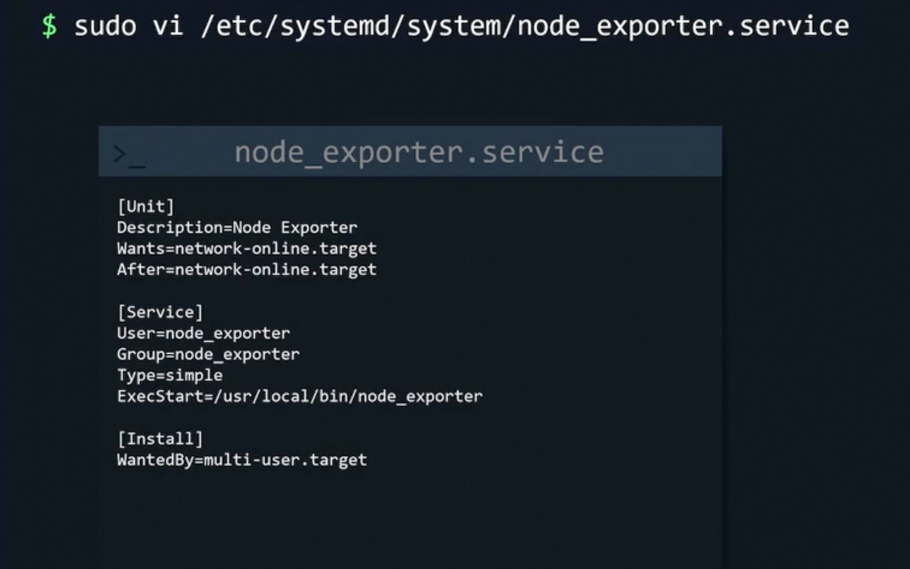
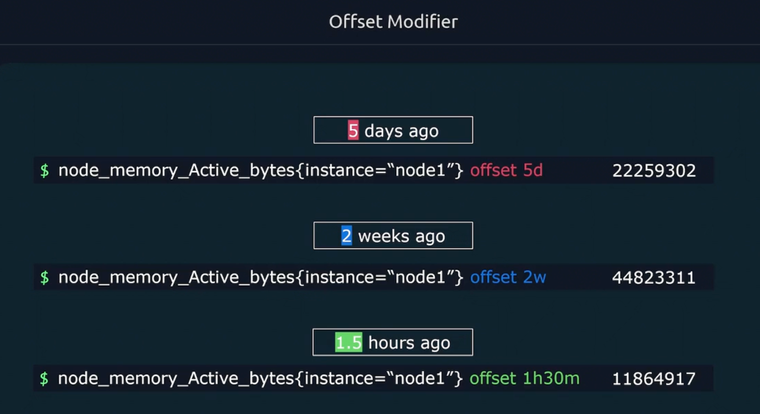
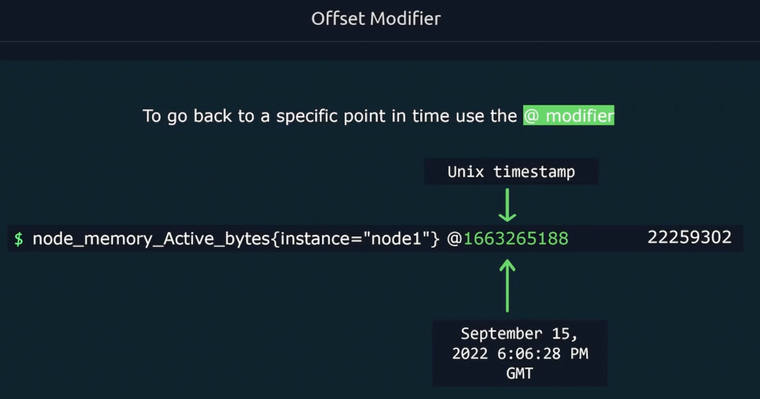
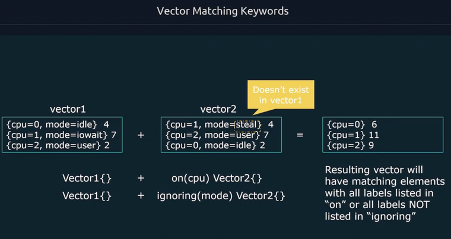
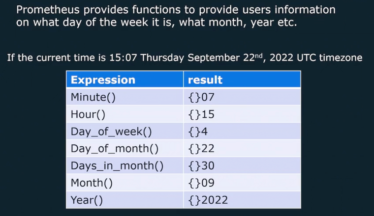
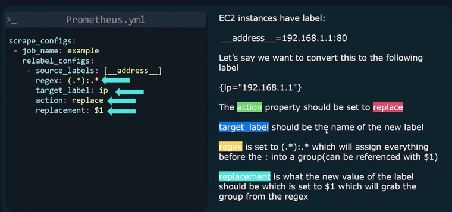
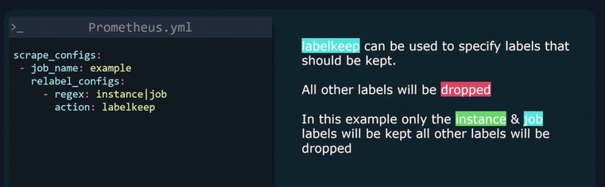
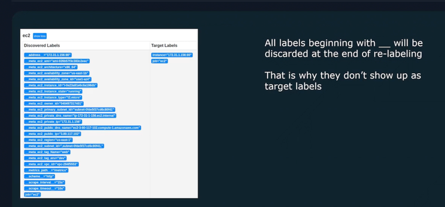
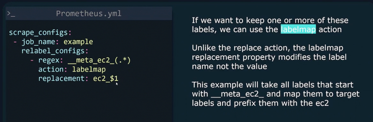

# Monitoring

## Install Prometheus & Node Exporter

[Download Prometheus](https://prometheus.io/download/)

```
sudo useradd --no-create-home --shell /bin/false prometheus
sudo mkdir /etc/prometheus
sudo cp prometheus.yml /etc/prometheus/prometheus.yml
sudo mkdir /var/lib/prometheus
sudo chown prometheus:prometheus /var/lib/prometheus
sudo cp prometheus /usr/local/bin
sudo cp promtool /usr/local/bin
sudo chown prometheus:prometheus /usr/local/bin/prometheus
sudo chown prometheus:prometheus /usr/local/bin/promtool
sudo cp -r consoles /etc/prometheus
sudo cp -r console_libraries /etc/prometheus
sudo chown -R prometheus:prometheus /etc/prometheus
```


/etc/systemd/system/prometheus.service
```
[Unit]
Description=Prometheus
Wants=network-online.target
After=network-online.target

[Service]
User=promethes
Group=prometheus
Type=simple
ExecStart=/usr/local/bin/prometheus \
    --config-file /etc/prometheus/prometheus.yml \
    --storage.tsdb.path /var/lib/prometheus \
    --web.console.templates=/etc/prometheus/consoles \
    --web.console.libraries=/etc/prometheus/console_libraries

[Install]
WantedBy=multi-user.target
```


## Prometheus configuration


## How to make secure connection between Node-exporter and Prometheus

### TLS

```
sudo openssl req -new -newkey rsa:2048 -days 365 -nodes -x509 -keyout node_exporter.key -out node_exporter.crt -subj "/C=Tashkent/ST=Uacademy/L=Udevs/O=Proxima/CN=localhost" -addext "subjectAltName = DNS:localhost"
vi config.yml

tls_server_config:
  cert_file: node_exporter.crt
  key_file: node_exporter.key
```

Move certificate and config file to /etc/node_exporter
```
sudo mkdir /etc/node_exporter
mv node_exporter.* /etc/node_exporter
sudo cp config.yaml /etc/node_exporter
chown -R node_exporter:node_exporter /etc/node_exporter

./node_exporter --web.config=config.yml
```

#### Check connection

```
curl https://localhost:9100/metrics # Error beradi. Self-signed sert bo'gani uchun
curl -k https://localhost:9100/metrics # Allow insecure connection
```

#### Copy certificate from node_exporter to Prometheus server
```
scp node_exporter:/node_exporter.crt prometheus:/etc/prometheus
chown -R prometheus:prometheus /etc/prometheus
vim /etc/prometheus/prometheus.yml
```
/etc/prometheus/prometheus.yml
```
scrape_configs:
  - job_name: "node"
    scheme: https
    tls_config:
      ca_file: /etc/prometheus/prometheus.yml
      insecure_skip_verify: true # self-signed bo'lgani uchun
```
### Authentication
Generate encrypted password
```
sudo apt install apache2-utils
htpasswd -nBC 12 "" | tr -d ':\n'
```
/etc/node_exporter/config.yml
```
basic_auth_users:
  prometheus: $12fdfgdfg...
```
Prometheus configuration
/etc/prometheus/prometheus.yml
```
- job_name: "node"
   basic_auth:
     username: prometheus
     password: nimadir # Encrypt qilinmagan password
```
## Metric types

### Counter

### Gauge

### Histogram

### Summary

### Labels

Check prometheus configurations
```
promtool check config /etc/prometheus/prometheus.yml
```
## Collect docker metrics
/etc/docker/daemon.json
```
{
  "metrics-addr": "127.0.0.1:9323",
  "experimental": true
}
```
```
systemctl restart docker
curl localhost:9323/metrics
```
## Cadvisor
```
VERSION=v0.36.0 # use the latest release version from https://github.com/google/cadvisor/releases
sudo docker run \
  --volume=/:/rootfs:ro \
  --volume=/var/run:/var/run:ro \
  --volume=/sys:/sys:ro \
  --volume=/var/lib/docker/:/var/lib/docker:ro \
  --volume=/dev/disk/:/dev/disk:ro \
  --publish=8080:8080 \
  --detach=true \
  --name=cadvisor \
  --privileged \
  --device=/dev/kmsg \
  gcr.io/cadvisor/cadvisor:$VERSION
```
## Queries
### Range data
 
### Get old data

### Get exact time metric

### Get old exact time metric

### Ignoring label mismatching

### Matching by a label

### Vector Matching Keywords

### Aggregation

```
by(instance, path) - instance va path labellari bo’yicha guruhlash

without(job) - job dan boshqa labellar bo’yicha guruhlash
```
## Functions
[Docs](https://prometheus.io/docs/prometheus/latest/querying/functions/)
### Date & time

## Relabeling

### Drop target

### Keep target

### Replace

### Drop label

### Keep label

### Default dropped labels

### Labelmap

Result

