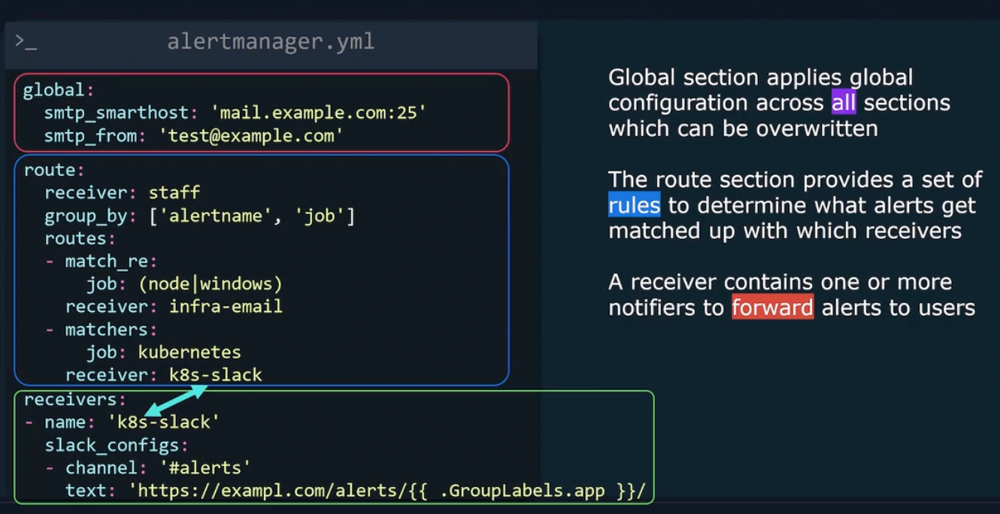

[Main menu](../README.md)

## Alerting

[Download](https://prometheus.io/download/)

/etc/prometheus/prometheus.yml
```
alerting:
  alertmanagers:
    - static_configs:
        - targets:
          - alertmanager1:9093
          - alertmanager2:9093
rule_files:
  - "/etc/prometheus/rules.yml"
```
/etc/prometheus/rules.yml
```
groups:
  - name: node
    interval: 60s
    rules:
      - alert: HostOutOfDiskSpace
        expr: (100 - (100 * node_filesystem_avail_bytes{mountpoint="/"} / node_filesystem_size_bytes{mountpoint="/"})) > 80
        for: 1m
        labels:
          severity: warning
          instance: "{{ $labels.instance }}"
        annotations:
          message: "Mountpoint: {{ $labels.mountpoint }}\n< 20% = {{ humanize $value }}%"
```
Install
```
sudo useradd --no-create-home --shell /bin/false alertmanager
sudo mkdir /etc/alertmanager
sudo cp alertmanager.yml /etc/alertmanager/
sudo mkdir /var/lib/alertmanager
sudo chown -R alertmanager:alertmanager /etc/alertmanager
sudo chown alertmanager:alertmanager /var/lib/alertmanager
sudo cp alertmanager /usr/local/bin
sudo cp amtool /usr/local/bin
sudo chown alertmanager:alertmanager /usr/local/bin/alertmanager
sudo chown alertmanager:alertmanager /usr/local/bin/amtool
```
Unit file 

/etc/systemd/system/alertmanager.service
```
[Unit]
Description=Alertmanager
Wants=network-online.target
After=network-online.target

[Service]
Type=simple
User=alertmanager
Group=alertmanager
ExecStart=/usr/local/bin/alertmanager \
  --config.file=/etc/alertmanager/alertmanager.yml
  --storage.path=/var/lib/alertmanager

Restart=always

[Install]
WantedBy=multi-user.target
```
### Global configuration



### Match Regexp


### Sub Routing


### Routing continue


### Grouping Alert Messages


### Templating Alerts


[Main menu](../README.md)