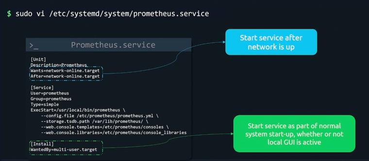
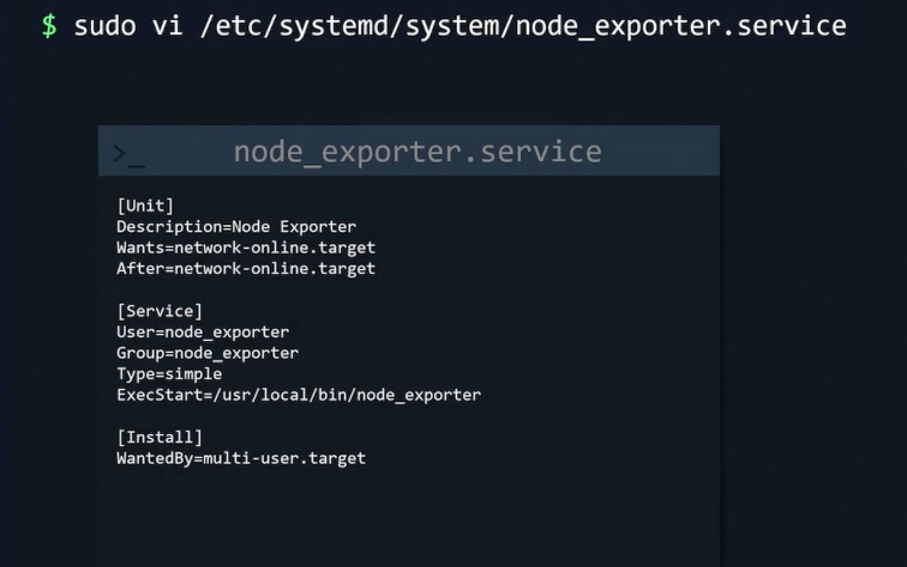
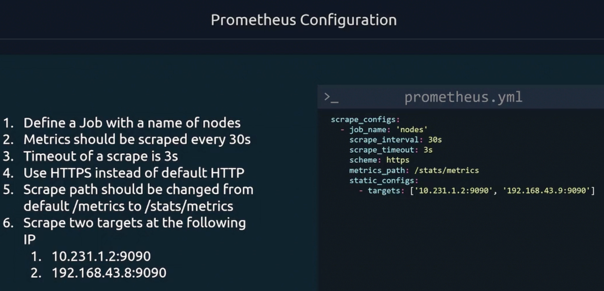

[Main menu](../README.md)

## Install Prometheus & Node Exporter


[Download Prometheus](https://prometheus.io/download/)

```
sudo useradd --no-create-home --shell /bin/false prometheus
sudo mkdir /etc/prometheus
sudo cp prometheus.yml /etc/prometheus/prometheus.yml
sudo mkdir /var/lib/prometheus
sudo chown prometheus:prometheus /var/lib/prometheus
sudo cp prometheus /usr/local/bin
sudo cp promtool /usr/local/bin
sudo chown prometheus:prometheus /usr/local/bin/prometheus
sudo chown prometheus:prometheus /usr/local/bin/promtool
sudo cp -r consoles /etc/prometheus
sudo cp -r console_libraries /etc/prometheus
sudo chown -R prometheus:prometheus /etc/prometheus
```


/etc/systemd/system/prometheus.service
```
[Unit]
Description=Prometheus
Wants=network-online.target
After=network-online.target

[Service]
User=promethes
Group=prometheus
Type=simple
ExecStart=/usr/local/bin/prometheus \
    --config-file /etc/prometheus/prometheus.yml \
    --storage.tsdb.path /var/lib/prometheus \
    --web.console.templates=/etc/prometheus/consoles \
    --web.console.libraries=/etc/prometheus/console_libraries

[Install]
WantedBy=multi-user.target
```


## Prometheus configuration



Check prometheus configurations
```
promtool check config /etc/prometheus/prometheus.yml
```

[Main menu](../README.md)