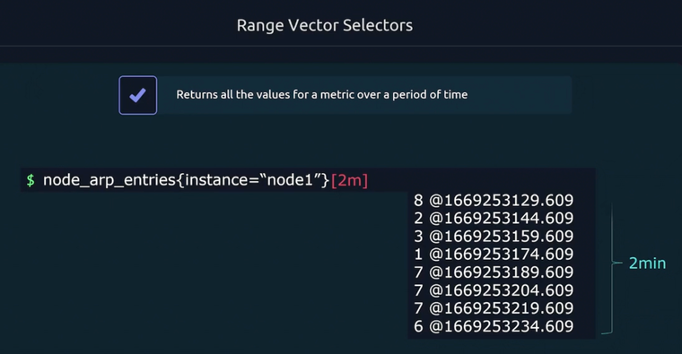
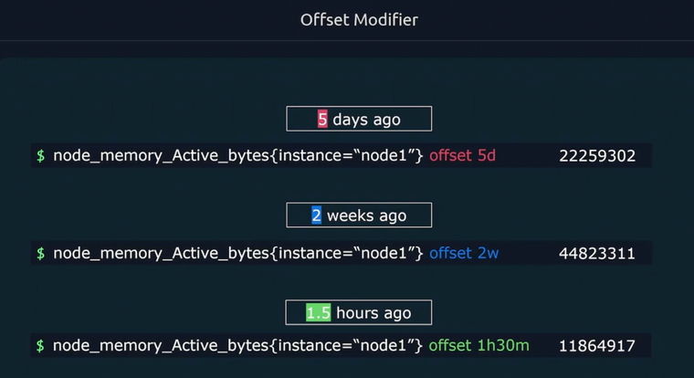
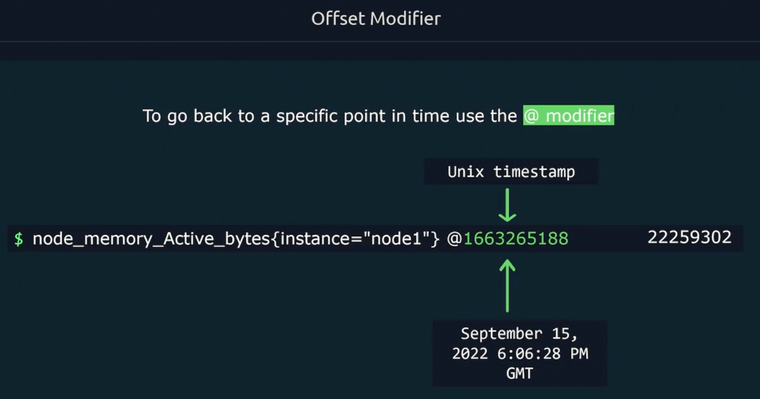
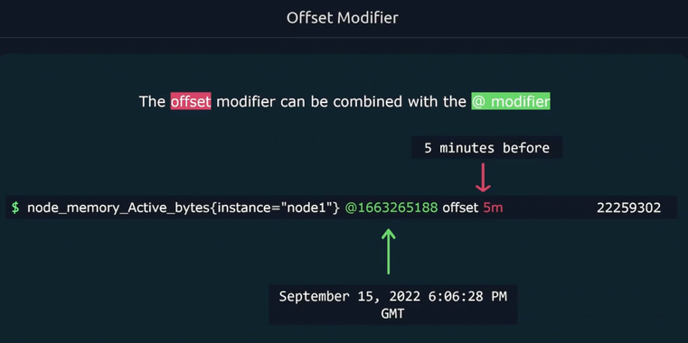
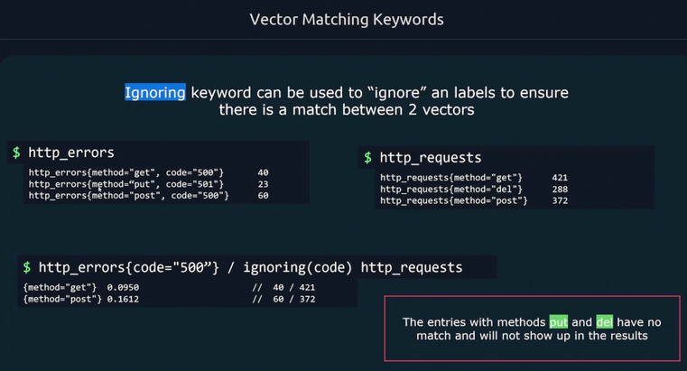
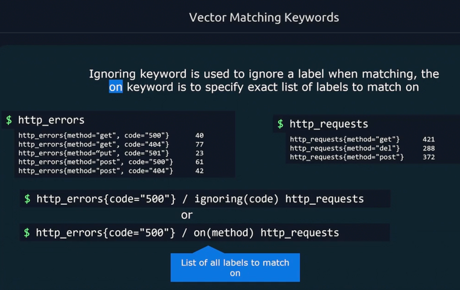
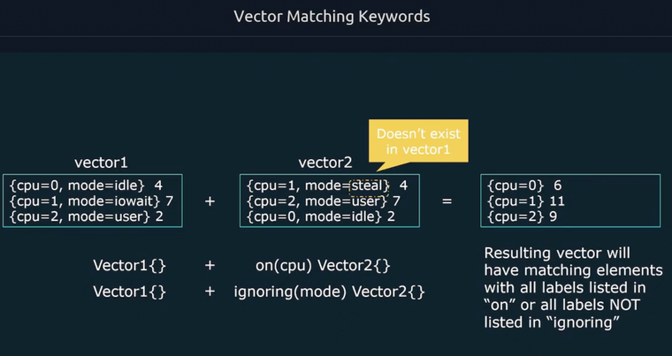
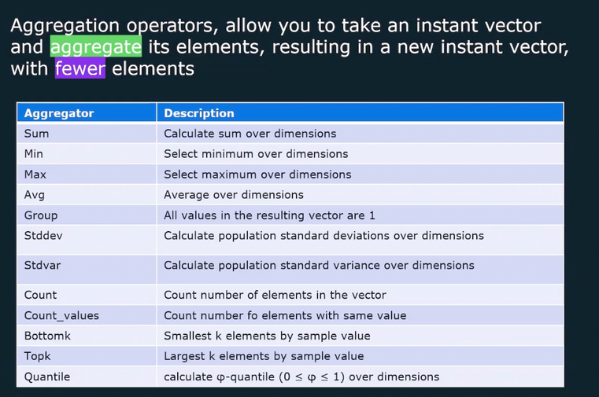

[Main menu](../README.md)

## Queries
### Range data
 
### Get old data

### Get exact time metric

### Get old exact time metric

### Ignoring label mismatching

### Matching by a label

### Vector Matching Keywords

### Aggregation

```
by(instance, path) - instance va path labellari bo’yicha guruhlash

without(job) - job dan boshqa labellar bo’yicha guruhlash
```

[Main menu](../README.md)